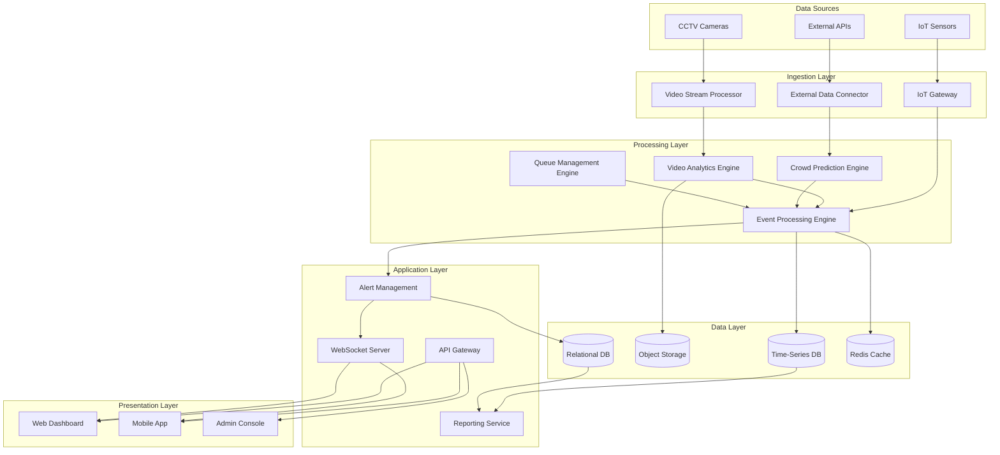
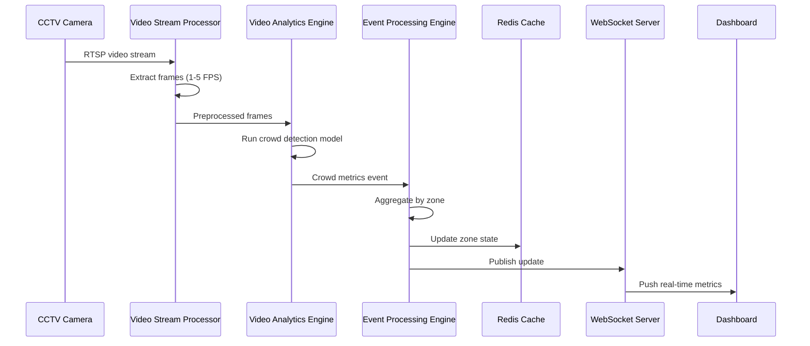
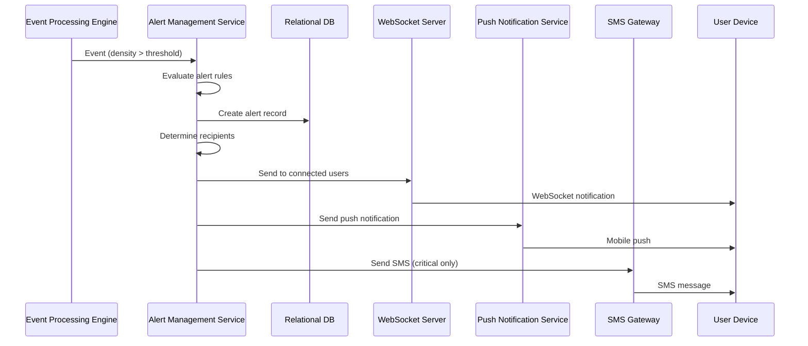
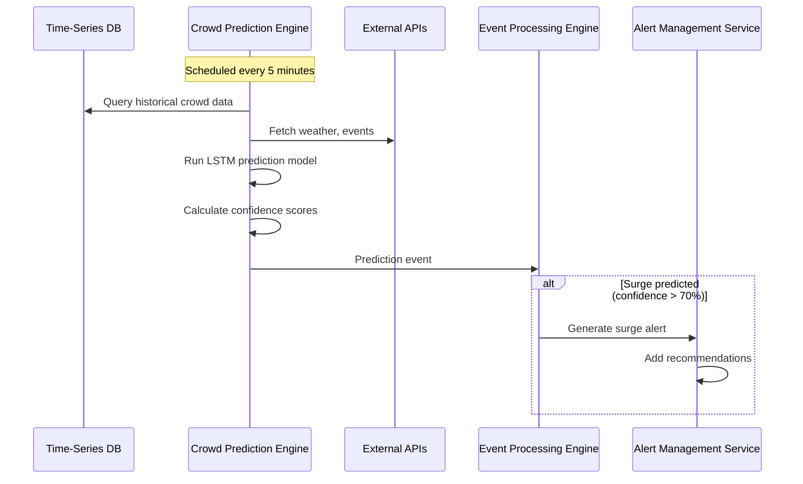
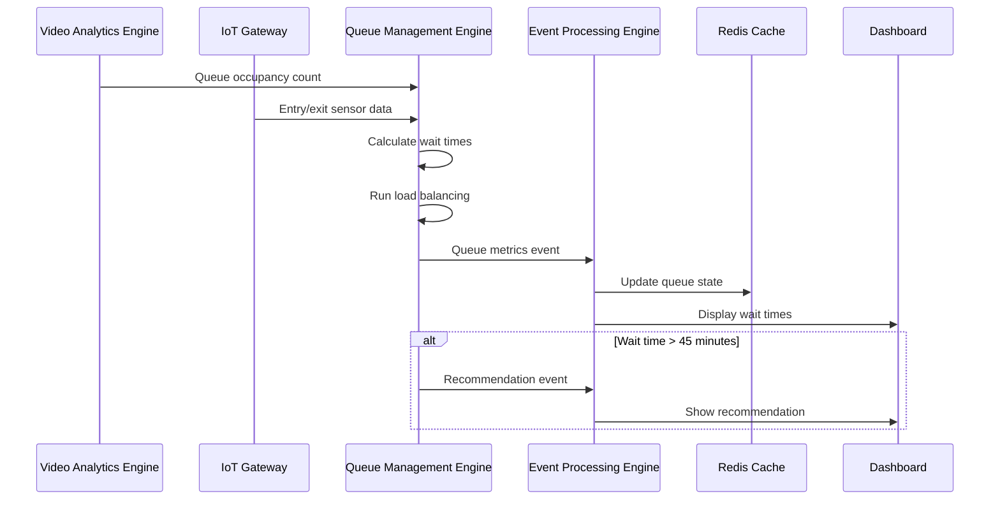
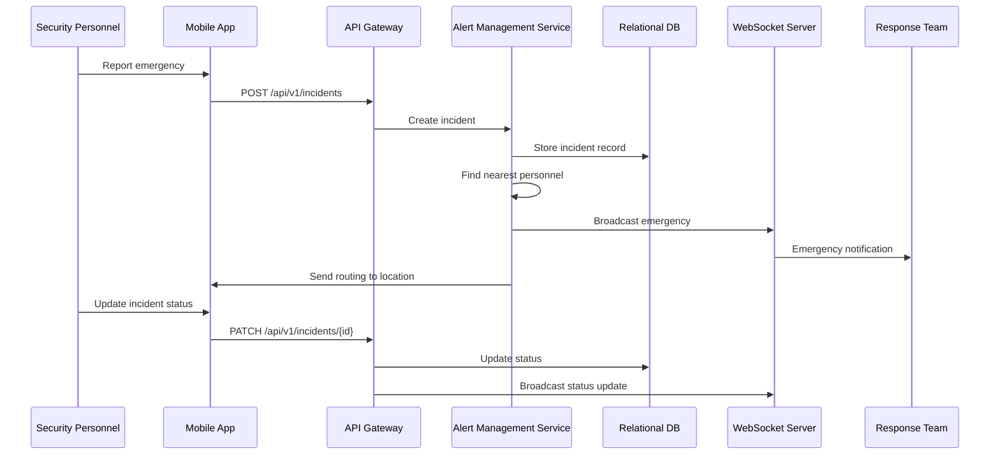

# Design Document: Temple & Pilgrimage Crowd Management System

## Overview

The Temple & Pilgrimage Crowd Management System is a distributed, cloud-native platform that combines computer vision, IoT sensor networks, and predictive AI to provide real-time crowd management capabilities. The system architecture follows a microservices pattern with event-driven communication, enabling scalability, fault tolerance, and real-time responsiveness. The platform processes video streams from hundreds of CCTV cameras, aggregates data from IoT sensors, applies machine learning models for crowd prediction and anomaly detection, and presents actionable insights through web and mobile dashboards.

The design emphasizes modularity, allowing independent scaling of compute-intensive components (video analytics, ML inference) while maintaining low-latency communication for critical alerts. The system supports multi-tenancy for deployment across multiple temple locations while maintaining data isolation and customizable configurations per site.

## High-Level Architecture

The system follows a layered architecture with clear separation of concerns:

### Architecture Layers

**1. Data Ingestion Layer**
- CCTV Stream Processors: Ingest and preprocess video streams from IP cameras
- IoT Gateway: Collect data from environmental and occupancy sensors
- External Data Connectors: Integrate weather, traffic, and emergency service APIs

**2. Processing Layer**
- Video Analytics Engine: Computer vision models for crowd density and anomaly detection
- Crowd Prediction Engine: Time-series forecasting models for surge prediction
- Queue Management Engine: Optimization algorithms for queue balancing
- Event Processing Engine: Real-time event stream processing and correlation

**3. Data Layer**
- Time-Series Database: Store sensor readings and crowd metrics
- Object Storage: Store video recordings and ML model artifacts
- Relational Database: Store configuration, user data, and incident records
- Cache Layer: Redis for real-time state and session management

**4. Application Layer**
- REST API Gateway: Unified API for web and mobile clients
- WebSocket Server: Real-time push notifications and live updates
- Alert Management Service: Rule-based alert generation and routing
- Reporting Service: Historical analytics and report generation

**5. Presentation Layer**
- Web Dashboard: React-based responsive web application
- Mobile Application: Native iOS/Android apps for field personnel
- Admin Console: System configuration and user management interface


### System Architecture Diagram



## Components and Interfaces

### 1. Video Stream Processor (VSP)

**Responsibility:** Ingest RTSP/RTMP video streams from IP cameras, perform preprocessing, and distribute frames to analytics engines.

**Key Functions:**
- Connect to multiple camera streams concurrently (support 200+ cameras per instance)
- Decode video streams and extract frames at configurable intervals (1-5 FPS for analytics)
- Apply preprocessing: resize, normalize, format conversion
- Implement frame buffering and backpressure handling
- Monitor stream health and reconnect on failures

**Interfaces:**
- Input: RTSP/RTMP streams from IP cameras
- Output: Preprocessed frames to Video Analytics Engine via message queue
- Configuration: Camera registry, stream URLs, frame extraction rate
- Monitoring: Stream health metrics, frame processing rate

**Technology:** Python with OpenCV, FFmpeg, and asyncio for concurrent stream handling


### 2. Video Analytics Engine (VAE)

**Responsibility:** Apply computer vision models to detect crowd density, count people, identify anomalous behaviors, and track movement patterns.

**Key Functions:**
- Crowd density estimation using deep learning models (CSRNet, MCNN)
- People counting and tracking across camera views
- Anomaly detection: running, fighting, unauthorized access, abandoned objects, reverse flow
- Movement pattern analysis and trajectory prediction
- Zone-based aggregation of analytics results

**Interfaces:**
- Input: Preprocessed video frames from VSP
- Output: Analytics events (crowd density, person count, anomalies) to Event Processing Engine
- Model Storage: Load ML models from Object Storage
- Configuration: Zone definitions, detection thresholds, model parameters

**Technology:** Python with PyTorch/TensorFlow, YOLO/Faster R-CNN for object detection, DeepSORT for tracking

**ML Models:**
- Crowd Density: CSRNet (Congested Scene Recognition Network)
- Person Detection: YOLOv8 fine-tuned on crowd datasets
- Anomaly Detection: Autoencoder-based approach for unusual pattern detection
- Tracking: DeepSORT for multi-object tracking across frames

### 3. IoT Gateway

**Responsibility:** Collect, validate, and aggregate data from distributed IoT sensors deployed across the temple complex.

**Key Functions:**
- Support multiple IoT protocols: MQTT, CoAP, HTTP
- Handle 500+ concurrent sensor connections
- Validate sensor data and filter outliers
- Aggregate readings by zone and time window
- Detect sensor failures and generate maintenance alerts

**Interfaces:**
- Input: Sensor data via MQTT/CoAP/HTTP
- Output: Aggregated sensor metrics to Event Processing Engine
- Configuration: Sensor registry, validation rules, aggregation windows
- Monitoring: Sensor health status, data quality metrics

**Technology:** Node.js with MQTT broker (Mosquitto), time-series buffering

**Supported Sensors:**
- Temperature and humidity sensors
- Air quality monitors (PM2.5, CO2)
- Occupancy sensors (infrared, ultrasonic)
- Noise level monitors
- Entry/exit counters

### 4. Crowd Prediction Engine (CPE)

**Responsibility:** Forecast crowd density and surge events using historical patterns, current conditions, and external factors.

**Key Functions:**
- Time-series forecasting for crowd density (30-minute horizon)
- Surge event prediction with confidence scores
- Incorporate external factors: weather, festivals, day of week
- Generate mitigation recommendations based on predictions
- Continuous model retraining with recent data

**Interfaces:**
- Input: Historical crowd data from Time-Series DB, current conditions from Event Processing Engine, external data (weather, events)
- Output: Predictions and recommendations to Event Processing Engine
- Model Storage: Load/save models to Object Storage
- Configuration: Prediction horizon, confidence thresholds, retraining schedule

**Technology:** Python with scikit-learn, Prophet, LSTM networks for time-series forecasting

**ML Models:**
- Base Forecasting: Facebook Prophet for seasonal patterns
- Surge Detection: LSTM network trained on historical surge events
- Feature Engineering: Weather conditions, festival calendar, historical patterns


### 5. Queue Management Engine (QME)

**Responsibility:** Optimize queue distribution, estimate wait times, and recommend queue management actions.

**Key Functions:**
- Track queue length and pilgrim flow rate for each queue
- Estimate wait times using Little's Law and historical flow rates
- Balance load across multiple queues using optimization algorithms
- Recommend queue openings/closings based on demand
- Calculate optimal pilgrim routes through the complex

**Interfaces:**
- Input: Queue occupancy from Video Analytics Engine, entry/exit counts from IoT Gateway
- Output: Queue metrics, wait time estimates, recommendations to Event Processing Engine
- Configuration: Queue definitions, capacity limits, optimization parameters

**Technology:** Python with optimization libraries (OR-Tools, PuLP)

**Algorithms:**
- Wait Time Estimation: M/M/c queuing model with empirical adjustments
- Load Balancing: Linear programming for optimal pilgrim distribution
- Route Optimization: Dijkstra's algorithm with dynamic edge weights based on congestion

### 6. Event Processing Engine (EPE)

**Responsibility:** Central event hub that correlates data from all sources, applies business rules, and triggers alerts.

**Key Functions:**
- Ingest events from all processing engines
- Apply complex event processing rules for alert generation
- Correlate events across time and space (e.g., crowd buildup + weather)
- Maintain real-time system state in cache
- Publish events to Alert Management Service and WebSocket Server

**Interfaces:**
- Input: Events from VAE, CPE, QME, IoT Gateway
- Output: Correlated events and alerts to Alert Management Service, state updates to Cache
- Storage: Write metrics to Time-Series DB
- Configuration: Event correlation rules, alert thresholds

**Technology:** Apache Kafka for event streaming, Apache Flink for stream processing, Redis for state management

**Event Types:**
- Crowd density updates (per zone, every 10 seconds)
- Anomaly detections (immediate)
- Predictions (every 5 minutes)
- Queue metrics (every 30 seconds)
- Sensor readings (every 30 seconds)
- Alerts (immediate)

### 7. Alert Management Service (AMS)

**Responsibility:** Generate, route, and track alerts based on configured rules and user preferences.

**Key Functions:**
- Evaluate alert rules against incoming events
- Determine alert severity (info, warning, critical)
- Route alerts to appropriate personnel based on roles and zones
- Support multiple notification channels: push notifications, SMS, email
- Track alert acknowledgment and resolution
- Implement escalation policies for unacknowledged critical alerts

**Interfaces:**
- Input: Events from Event Processing Engine
- Output: Notifications via WebSocket, push notification services, SMS gateway, email
- Storage: Alert history in Relational DB
- Configuration: Alert rules, notification preferences, escalation policies

**Technology:** Node.js with rule engine, integration with Firebase Cloud Messaging (push), Twilio (SMS), SendGrid (email)


### 8. API Gateway

**Responsibility:** Provide unified REST API for all client applications with authentication, rate limiting, and request routing.

**Key Functions:**
- Authenticate and authorize API requests using JWT tokens
- Route requests to appropriate backend services
- Implement rate limiting and request throttling
- Cache frequently accessed data
- Provide API documentation (OpenAPI/Swagger)
- Log all API requests for audit

**Interfaces:**
- Input: HTTP/HTTPS requests from web and mobile clients
- Output: Responses from backend services
- Authentication: Validate JWT tokens, integrate with identity provider
- Monitoring: API metrics, error rates, latency

**Technology:** Kong or AWS API Gateway with JWT authentication

**Key API Endpoints:**
- `/api/v1/zones` - Get zone information and current metrics
- `/api/v1/alerts` - Query and manage alerts
- `/api/v1/queues` - Get queue status and wait times
- `/api/v1/cameras` - Access camera feeds and recordings
- `/api/v1/reports` - Generate and retrieve reports
- `/api/v1/config` - System configuration management

### 9. WebSocket Server

**Responsibility:** Provide real-time bidirectional communication for live updates and notifications.

**Key Functions:**
- Maintain persistent connections with web and mobile clients
- Push real-time updates: crowd metrics, alerts, queue status
- Support room-based subscriptions (subscribe to specific zones)
- Handle connection lifecycle: authentication, heartbeat, reconnection
- Scale horizontally with Redis pub/sub for message distribution

**Interfaces:**
- Input: Events from Event Processing Engine and Alert Management Service
- Output: Real-time messages to connected clients
- State Management: Redis for connection state and pub/sub
- Authentication: Validate JWT tokens on connection

**Technology:** Node.js with Socket.IO, Redis for pub/sub

**Message Types:**
- Crowd density updates
- Alert notifications
- Queue status changes
- System health updates
- Emergency broadcasts

### 10. Reporting Service

**Responsibility:** Generate historical reports, analytics, and data exports.

**Key Functions:**
- Generate daily/weekly/monthly summary reports
- Provide comparative analysis across time periods
- Identify patterns and trends in crowd behavior
- Export data in multiple formats (PDF, CSV, Excel)
- Schedule automated report generation and distribution

**Interfaces:**
- Input: Historical data from Time-Series DB and Relational DB
- Output: Generated reports via API or email
- Configuration: Report templates, scheduling, distribution lists

**Technology:** Python with Pandas for data analysis, ReportLab for PDF generation, Celery for scheduled tasks


## Data Models

### Zone

Represents a defined area within the temple complex with monitoring capabilities.

```typescript
interface Zone {
  id: string;                    // Unique zone identifier
  name: string;                  // Human-readable zone name
  templeId: string;              // Parent temple identifier
  geometry: Polygon;             // Geographic boundary (GeoJSON)
  capacityThreshold: number;     // Maximum safe occupancy
  zoneType: 'entry' | 'queue' | 'worship' | 'pathway' | 'exit';
  cameras: string[];             // Associated camera IDs
  sensors: string[];             // Associated sensor IDs
  parentZone?: string;           // Optional parent zone for hierarchical zones
  metadata: {
    description?: string;
    floorLevel?: number;
    accessRestrictions?: string[];
  };
  createdAt: Date;
  updatedAt: Date;
}
```

### CrowdMetric

Real-time crowd measurement for a specific zone.

```typescript
interface CrowdMetric {
  id: string;
  zoneId: string;
  timestamp: Date;
  personCount: number;           // Estimated number of people
  density: number;               // People per square meter
  densityPercentage: number;     // Percentage of capacity threshold
  flowRate: number;              // People per minute entering/exiting
  averageSpeed: number;          // Average movement speed (m/s)
  confidence: number;            // Confidence score (0-1)
  source: 'video' | 'sensor' | 'hybrid';
}
```

### Alert

System-generated alert requiring attention.

```typescript
interface Alert {
  id: string;
  type: 'crowd_surge' | 'anomaly' | 'capacity_exceeded' | 'sensor_failure' | 'emergency';
  severity: 'info' | 'warning' | 'critical';
  zoneId: string;
  title: string;
  description: string;
  timestamp: Date;
  metadata: {
    crowdDensity?: number;
    predictedSurgeTime?: Date;
    anomalyType?: string;
    cameraId?: string;
    videoClipUrl?: string;
    recommendations?: string[];
  };
  status: 'active' | 'acknowledged' | 'resolved';
  assignedTo?: string[];         // User IDs of assigned personnel
  acknowledgedAt?: Date;
  acknowledgedBy?: string;
  resolvedAt?: Date;
  resolvedBy?: string;
  resolutionNotes?: string;
}
```

### Queue

Represents a pilgrim queue with tracking information.

```typescript
interface Queue {
  id: string;
  name: string;
  zoneId: string;
  entryPoints: string[];         // Zone IDs where queue starts
  exitPoint: string;             // Zone ID where queue ends
  status: 'active' | 'paused' | 'closed';
  currentLength: number;         // Number of people in queue
  estimatedWaitTime: number;     // Minutes
  flowRate: number;              // People per minute
  capacity: number;              // Maximum queue capacity
  lastUpdated: Date;
}
```

### Prediction

Crowd forecast generated by prediction engine.

```typescript
interface Prediction {
  id: string;
  zoneId: string;
  predictionType: 'density' | 'surge' | 'wait_time';
  timestamp: Date;               // When prediction was made
  forecastTime: Date;            // Time being predicted
  forecastHorizon: number;       // Minutes into future
  predictedValue: number;
  confidence: number;            // 0-1
  recommendations: string[];
  modelVersion: string;
}
```

### Camera

CCTV camera configuration and status.

```typescript
interface Camera {
  id: string;
  name: string;
  templeId: string;
  streamUrl: string;             // RTSP/RTMP URL
  location: {
    latitude: number;
    longitude: number;
    elevation?: number;
  };
  zonesCovered: string[];        // Zone IDs visible to this camera
  status: 'online' | 'offline' | 'error';
  capabilities: {
    resolution: string;          // e.g., "1920x1080"
    fps: number;
    ptz: boolean;                // Pan-Tilt-Zoom capable
    nightVision: boolean;
  };
  lastHeartbeat: Date;
  createdAt: Date;
}
```

### IoTSensor

IoT sensor configuration and status.

```typescript
interface IoTSensor {
  id: string;
  name: string;
  templeId: string;
  zoneId: string;
  sensorType: 'temperature' | 'humidity' | 'air_quality' | 'occupancy' | 'noise';
  protocol: 'mqtt' | 'coap' | 'http';
  status: 'online' | 'offline' | 'error';
  lastReading: {
    value: number;
    unit: string;
    timestamp: Date;
  };
  thresholds: {
    warning?: number;
    critical?: number;
  };
  lastHeartbeat: Date;
  createdAt: Date;
}
```

### User

System user with role-based access.

```typescript
interface User {
  id: string;
  username: string;
  email: string;
  passwordHash: string;
  role: 'admin' | 'temple_authority' | 'security' | 'viewer';
  templeIds: string[];           // Temples user has access to
  zoneIds?: string[];            // Specific zones (for security personnel)
  preferences: {
    language: string;
    notificationChannels: ('push' | 'sms' | 'email')[];
    alertTypes: string[];        // Alert types user wants to receive
  };
  mobileDevices: {
    deviceId: string;
    platform: 'ios' | 'android';
    pushToken: string;
  }[];
  lastLogin: Date;
  createdAt: Date;
}
```

### Incident

Recorded emergency or significant event.

```typescript
interface Incident {
  id: string;
  type: 'stampede' | 'fire' | 'medical' | 'security' | 'other';
  severity: 'minor' | 'major' | 'critical';
  zoneId: string;
  title: string;
  description: string;
  reportedAt: Date;
  reportedBy: string;            // User ID
  status: 'reported' | 'responding' | 'resolved';
  assignedPersonnel: string[];   // User IDs
  responseTime?: number;         // Seconds from report to first response
  resolutionTime?: number;       // Seconds from report to resolution
  actions: {
    timestamp: Date;
    userId: string;
    action: string;
    notes?: string;
  }[];
  videoEvidence?: string[];      // URLs to video clips
  resolvedAt?: Date;
  postIncidentReport?: string;
}
```


## Data Flow

### 1. Real-Time Crowd Monitoring Flow



### 2. Alert Generation and Notification Flow



### 3. Crowd Surge Prediction Flow



### 4. Queue Management Flow



### 5. Emergency Response Flow



### 6. Video Analytics Processing Pipeline

```
Raw Video Stream (RTSP)
    ↓
[Video Stream Processor]
    ↓ (Frames @ 1-5 FPS)
[Preprocessing: Resize, Normalize]
    ↓
[Person Detection: YOLOv8]
    ↓ (Bounding boxes)
[Multi-Object Tracking: DeepSORT]
    ↓ (Tracked objects with IDs)
[Crowd Density Estimation: CSRNet]
    ↓ (Density map)
[Zone Aggregation]
    ↓ (Per-zone metrics)
[Anomaly Detection: Autoencoder]
    ↓ (Anomaly scores)
[Event Generation]
    ↓
Event Processing Engine
```


## Technology Stack

### Backend Services

**Video Stream Processor & Video Analytics Engine**
- Language: Python 3.11+
- Frameworks: OpenCV, FFmpeg, PyTorch
- ML Models: YOLOv8, CSRNet, DeepSORT
- Deployment: Docker containers on GPU-enabled nodes (NVIDIA T4 or better)

**Crowd Prediction Engine**
- Language: Python 3.11+
- ML Libraries: scikit-learn, Prophet, TensorFlow/Keras
- Data Processing: Pandas, NumPy
- Deployment: Docker containers with scheduled execution

**IoT Gateway**
- Language: Node.js 18+
- MQTT Broker: Eclipse Mosquitto
- Protocols: MQTT, CoAP, HTTP
- Deployment: Docker containers with high availability

**Queue Management Engine**
- Language: Python 3.11+
- Optimization: OR-Tools, PuLP
- Deployment: Docker containers

**Event Processing Engine**
- Stream Processing: Apache Kafka + Apache Flink
- Message Queue: Apache Kafka
- State Management: Redis 7+
- Deployment: Kubernetes StatefulSets

**Alert Management Service**
- Language: Node.js 18+ with TypeScript
- Notification Services: Firebase Cloud Messaging, Twilio, SendGrid
- Deployment: Docker containers with horizontal scaling

**API Gateway**
- Technology: Kong Gateway or AWS API Gateway
- Authentication: JWT with RS256
- Rate Limiting: Redis-backed token bucket
- Deployment: Kubernetes Deployment with auto-scaling

**WebSocket Server**
- Language: Node.js 18+ with TypeScript
- Framework: Socket.IO
- Pub/Sub: Redis
- Deployment: Kubernetes Deployment with session affinity

**Reporting Service**
- Language: Python 3.11+
- Libraries: Pandas, ReportLab, Matplotlib
- Task Queue: Celery with Redis broker
- Deployment: Docker containers with Celery workers

### Data Storage

**Time-Series Database**
- Technology: InfluxDB 2.x or TimescaleDB
- Purpose: Store crowd metrics, sensor readings, predictions
- Retention: 24 months with downsampling
- Deployment: Kubernetes StatefulSet with persistent volumes

**Object Storage**
- Technology: MinIO (self-hosted) or AWS S3
- Purpose: Video recordings, ML models, report files
- Retention: 30 days for videos, indefinite for models
- Deployment: Distributed MinIO cluster or managed S3

**Relational Database**
- Technology: PostgreSQL 15+
- Purpose: Configuration, users, alerts, incidents
- Deployment: Kubernetes StatefulSet with replication (primary + 2 replicas)
- Backup: Daily automated backups with point-in-time recovery

**Cache Layer**
- Technology: Redis 7+ (Cluster mode)
- Purpose: Real-time state, session management, pub/sub
- Deployment: Redis Cluster with 6 nodes (3 primary + 3 replica)

### Frontend Applications

**Web Dashboard**
- Framework: React 18+ with TypeScript
- State Management: Redux Toolkit
- UI Components: Material-UI (MUI)
- Maps: Mapbox GL JS or Leaflet
- Charts: Recharts or Chart.js
- Real-time: Socket.IO client
- Build Tool: Vite
- Deployment: Static hosting (Nginx, CloudFront)

**Mobile Application**
- Framework: React Native with TypeScript
- Navigation: React Navigation
- State Management: Redux Toolkit
- Maps: React Native Maps
- Push Notifications: Firebase Cloud Messaging
- Platforms: iOS 14+, Android 8+
- Deployment: App Store, Google Play

**Admin Console**
- Framework: React 18+ with TypeScript (shared codebase with Dashboard)
- Additional Features: User management, system configuration
- Deployment: Static hosting with restricted access

### Infrastructure

**Container Orchestration**
- Technology: Kubernetes 1.27+
- Distribution: EKS (AWS), GKE (Google Cloud), or self-hosted
- Ingress: NGINX Ingress Controller
- Service Mesh: Istio (optional, for advanced traffic management)

**CI/CD**
- Version Control: Git (GitHub/GitLab)
- CI/CD Platform: GitHub Actions, GitLab CI, or Jenkins
- Container Registry: Docker Hub, ECR, or Harbor
- Deployment Strategy: Rolling updates with health checks

**Monitoring & Observability**
- Metrics: Prometheus + Grafana
- Logging: ELK Stack (Elasticsearch, Logstash, Kibana) or Loki
- Tracing: Jaeger or Zipkin
- Alerting: Prometheus Alertmanager

**Security**
- Secrets Management: HashiCorp Vault or Kubernetes Secrets with encryption
- Certificate Management: cert-manager with Let's Encrypt
- Network Policies: Kubernetes NetworkPolicies
- Vulnerability Scanning: Trivy or Clair


## Security Considerations

### Authentication and Authorization

**User Authentication**
- JWT-based authentication with RS256 signing
- Token expiration: 1 hour for access tokens, 7 days for refresh tokens
- Multi-factor authentication (MFA) required for admin and temple authority roles
- Password requirements: minimum 12 characters, complexity rules enforced
- Account lockout after 5 failed login attempts

**Authorization Model**
- Role-Based Access Control (RBAC) with four primary roles:
  - Admin: Full system access, user management, configuration
  - Temple Authority: View all data, manage alerts, generate reports
  - Security Personnel: View assigned zones, respond to incidents, update status
  - Viewer: Read-only access to dashboards and reports
- Zone-based access control: Security personnel limited to assigned zones
- API endpoint authorization enforced at gateway level

**Service-to-Service Authentication**
- Mutual TLS (mTLS) for internal service communication
- Service accounts with limited permissions
- API keys for external integrations with rotation policy

### Data Protection

**Encryption**
- Data in transit: TLS 1.3 for all external communications
- Data at rest: AES-256 encryption for databases and object storage
- Video streams: Encrypted RTSP (RTSPS) where supported
- Secrets: Encrypted at rest using Vault or Kubernetes encryption

**Privacy Compliance**
- Video analytics: No facial recognition or personally identifiable features stored
- Data anonymization: Aggregate metrics only, no individual tracking
- Data retention: Automated deletion after configured periods (30 days for video)
- Right to deletion: API endpoints for data subject requests
- Audit logging: All access to sensitive data logged with user attribution

**Video Data Handling**
- Live streams: Encrypted transmission, no persistent storage unless incident flagged
- Recorded footage: Encrypted storage with access logging
- Analytics data: Only aggregate counts and density maps stored
- Retention policy: 30 days default, extended for incident investigation
- Access control: Video access requires explicit permission and is logged

### Network Security

**Perimeter Security**
- Web Application Firewall (WAF) for API Gateway
- DDoS protection at load balancer level
- IP whitelisting for admin console access
- VPN required for administrative access to infrastructure

**Internal Network Segmentation**
- Kubernetes NetworkPolicies to isolate services
- Separate namespaces for different security zones
- Database access restricted to application services only
- IoT network isolated from application network

**API Security**
- Rate limiting: 100 requests/minute per user, 1000/minute per IP
- Input validation: Strict schema validation for all API inputs
- SQL injection prevention: Parameterized queries only
- XSS prevention: Content Security Policy headers
- CORS: Restricted to known frontend origins

### Incident Response

**Security Monitoring**
- Real-time monitoring of authentication failures
- Anomaly detection for unusual API access patterns
- Automated alerts for security events
- Integration with SIEM systems for enterprise deployments

**Incident Response Plan**
- Defined escalation procedures for security incidents
- Automated containment: Disable compromised accounts, block IPs
- Forensic logging: Immutable audit logs for investigation
- Communication plan: Notify affected parties within 24 hours

**Vulnerability Management**
- Regular security scanning of container images
- Dependency vulnerability scanning in CI/CD pipeline
- Quarterly penetration testing
- Bug bounty program for responsible disclosure

### Compliance

**Regulatory Compliance**
- GDPR compliance for European deployments
- Local data protection laws (e.g., India's IT Act)
- Video surveillance regulations compliance
- Regular compliance audits

**Audit Requirements**
- Comprehensive audit logging of all user actions
- Immutable audit logs stored separately from application data
- Audit log retention: 7 years
- Regular audit log reviews and reporting


## Scalability Approach

### Horizontal Scaling Strategy

**Stateless Services**
All application services (API Gateway, Alert Management, Reporting) are designed as stateless microservices that can scale horizontally:
- Kubernetes Horizontal Pod Autoscaler (HPA) based on CPU/memory metrics
- Target: 70% CPU utilization, scale up when exceeded for 2 minutes
- Minimum replicas: 2 per service for high availability
- Maximum replicas: 10 per service (configurable per deployment size)

**Stateful Services**
- Event Processing Engine: Kafka partitioning for parallel processing, Flink parallelism
- Databases: Read replicas for PostgreSQL, Redis Cluster for distributed caching
- Time-Series DB: Sharding by temple ID and time range

**Video Analytics Scaling**
- GPU-accelerated nodes for video processing
- Dynamic scaling based on camera count and processing queue depth
- Each Video Analytics Engine instance handles 20-30 cameras
- Auto-scaling triggers when processing queue exceeds 100 frames

### Data Partitioning

**Temporal Partitioning**
- Time-series data partitioned by month
- Automatic partition creation and old partition archival
- Query optimization using partition pruning

**Spatial Partitioning**
- Data partitioned by temple ID for multi-tenancy
- Each temple's data isolated in separate database schemas
- Enables per-temple scaling and data residency compliance

**Event Stream Partitioning**
- Kafka topics partitioned by zone ID
- Ensures ordered processing within each zone
- Parallel processing across zones

### Caching Strategy

**Multi-Level Caching**
1. **Application Cache**: In-memory cache in each service instance (5-minute TTL)
2. **Distributed Cache**: Redis for shared state across instances (15-minute TTL)
3. **CDN Cache**: Static assets and public data cached at edge (24-hour TTL)

**Cache Invalidation**
- Event-driven invalidation: Cache entries invalidated on data updates
- Time-based expiration: Automatic expiration for stale data
- Manual invalidation: API endpoints for forced cache clearing

### Load Balancing

**External Load Balancing**
- Layer 7 load balancer (Application Load Balancer) for HTTP/HTTPS traffic
- Geographic load balancing for multi-region deployments
- Health checks every 30 seconds with automatic failover

**Internal Load Balancing**
- Kubernetes Service load balancing for internal traffic
- Client-side load balancing for gRPC services
- Consistent hashing for cache distribution

### Database Optimization

**Query Optimization**
- Indexed columns: zone_id, timestamp, user_id, alert_status
- Materialized views for complex aggregations
- Query result caching for expensive reports

**Connection Pooling**
- PgBouncer for PostgreSQL connection pooling
- Pool size: 20 connections per application instance
- Connection timeout: 30 seconds

**Read/Write Splitting**
- Write operations to primary database
- Read operations distributed across replicas
- Automatic failover to primary if replicas unavailable

### Performance Targets

**Latency Requirements**
- API response time: p95 < 200ms, p99 < 500ms
- WebSocket message delivery: < 100ms
- Video analytics processing: < 2 seconds per frame
- Alert generation: < 3 seconds from event detection
- Dashboard load time: < 2 seconds

**Throughput Requirements**
- API requests: 10,000 requests/second per cluster
- Video streams: 200 concurrent camera streams per cluster
- IoT sensor data: 500 sensors × 2 readings/minute = 1,000 data points/minute
- Event processing: 100,000 events/second

**Scalability Limits**
- Single cluster: Up to 500 cameras, 1,000 IoT sensors, 5 temple locations
- Multi-cluster: Unlimited scaling with federated architecture
- Database: Up to 10TB data per temple with partitioning

### Multi-Tenancy Architecture

**Tenant Isolation**
- Database schema per temple for data isolation
- Kubernetes namespace per temple for resource isolation
- Separate encryption keys per temple

**Resource Allocation**
- Resource quotas per temple namespace
- Quality of Service (QoS) classes: Guaranteed for critical services, Burstable for analytics
- Fair scheduling to prevent resource starvation

**Tenant-Specific Scaling**
- Independent scaling per temple based on load
- Dedicated GPU nodes for high-traffic temples
- Shared infrastructure for smaller temples

### Disaster Recovery

**Backup Strategy**
- Database: Daily full backups, hourly incremental backups
- Object storage: Cross-region replication
- Configuration: Version-controlled in Git, automated restore

**Recovery Time Objectives**
- RTO (Recovery Time Objective): 1 hour for critical services
- RPO (Recovery Point Objective): 15 minutes for transactional data
- Video data: Best effort recovery (30-day retention)

**High Availability**
- Multi-zone deployment for fault tolerance
- Automatic failover for all stateful services
- Health checks and self-healing with Kubernetes

**Disaster Recovery Testing**
- Quarterly DR drills
- Automated failover testing in staging environment
- Documented runbooks for manual intervention


## Correctness Properties

A property is a characteristic or behavior that should hold true across all valid executions of a system—essentially, a formal statement about what the system should do. Properties serve as the bridge between human-readable specifications and machine-verifiable correctness guarantees.

### Property Reflection

After analyzing all acceptance criteria, I identified the following redundancies and consolidations:

**Consolidated Alert Properties:**
- Requirements 1.3 and 1.4 (warning and critical density alerts) can be combined into a single property about threshold-based alerting
- Requirements 4.2 and 7.2 (anomaly and environmental alerts) follow the same pattern and can use a unified alert generation property

**Consolidated Dashboard Properties:**
- Requirements 8.1, 8.3, and 8.4 all test that dashboard state contains required data - these can be combined into a comprehensive dashboard completeness property

**Consolidated Logging Properties:**
- Requirements 10.4, 12.4, and 14.5 all test audit logging - these can be unified into a single audit logging property

**Consolidated Configuration Properties:**
- Requirements 10.1, 10.2, and 10.3 all test configuration management - these can be combined into a configuration management property

The following properties represent the unique, non-redundant correctness guarantees for the system:

### Core Monitoring Properties

**Property 1: Crowd Density Calculation**
*For any* valid video frame from a CCTV camera, the Video Analytics Engine should calculate a crowd density value for each zone visible in that frame, with the density value being a non-negative number.
**Validates: Requirements 1.1**

**Property 2: Threshold-Based Alert Generation**
*For any* zone where crowd density exceeds a configured threshold percentage (80% for warning, 95% for critical), the Alert System should generate an alert with appropriate severity and notify the correct personnel roles.
**Validates: Requirements 1.3, 1.4**

**Property 3: Anomaly Detection and Alerting**
*For any* detected anomalous behavior with confidence above the configured threshold (80%), the Alert System should generate an alert containing the anomaly type, confidence score, video evidence, and camera location.
**Validates: Requirements 4.1, 4.2, 4.3**

**Property 4: Environmental Condition Alerting**
*For any* IoT sensor reading that exceeds safety thresholds (temperature > 40°C or air quality index > 150), the Alert System should notify Temple Authority with the sensor location and current reading.
**Validates: Requirements 7.2**

### Prediction Properties

**Property 5: Crowd Surge Forecast Generation**
*For any* set of historical crowd data and current conditions, the Crowd Predictor should generate forecasts for the next 30 minutes with confidence scores, predicted density values, and forecast timestamps.
**Validates: Requirements 2.1**

**Property 6: Predictive Alert with Lead Time**
*For any* crowd surge prediction with confidence above 70%, the Alert System should generate a notification that includes the predicted surge time, location, severity, and recommended mitigation actions.
**Validates: Requirements 2.2, 2.3**

### Queue Management Properties

**Property 7: Queue Metrics Tracking**
*For any* active queue with pilgrims, the Queue Manager should maintain current queue length, estimated wait time, and flow rate values that are all non-negative numbers.
**Validates: Requirements 3.1**

**Property 8: Queue Wait Time Recommendations**
*For any* queue where estimated wait time exceeds 45 minutes, the Queue Manager should generate recommendations for opening additional entry points or redirecting pilgrims.
**Validates: Requirements 3.2**

**Property 9: Queue Load Balancing**
*For any* set of multiple active queues, the Queue Manager's load balancing algorithm should produce a pilgrim distribution where the maximum wait time across all queues is minimized compared to unbalanced distribution.
**Validates: Requirements 3.3**

**Property 10: Queue Status Completeness**
*For any* active queue, the system state should include queue length, wait time estimate, flow rate, and status for display on the dashboard.
**Validates: Requirements 3.4**

### Emergency Response Properties

**Property 11: Emergency Notification Broadcast**
*For any* detected or reported emergency event, the Alert System should notify all Security Personnel assigned to the affected zone or marked as available.
**Validates: Requirements 5.1**

**Property 12: Emergency Routing Calculation**
*For any* active emergency event, the system should identify available Security Personnel and calculate optimal routes from their current locations to the incident location.
**Validates: Requirements 5.2**

**Property 13: Emergency Incident Completeness**
*For any* active emergency event, the dashboard state should include incident location, type, severity, assigned responders, and current status.
**Validates: Requirements 5.3**

**Property 14: Bidirectional Emergency Communication**
*For any* active emergency event, messages should be deliverable from Security Personnel to the control center and from the control center to Security Personnel.
**Validates: Requirements 5.4**

**Property 15: Incident Logging Completeness**
*For any* resolved emergency event, the incident record should include all details (type, location, severity), response time, resolution time, assigned personnel, and resolution actions.
**Validates: Requirements 5.5**

### Traffic Flow Properties

**Property 16: Congestion Point Identification**
*For any* traffic flow data where movement speed drops below 0.5 meters per second, the system should identify and flag that location as a congestion point.
**Validates: Requirements 6.1**

**Property 17: Congestion Mitigation Recommendations**
*For any* identified congestion point, the system should generate recommendations for route adjustments or pathway openings to improve traffic flow.
**Validates: Requirements 6.2**

**Property 18: Optimal Route Calculation**
*For any* entry point and destination pair, the system should calculate an optimal route based on current crowd conditions, with the route avoiding congested zones when alternatives exist.
**Validates: Requirements 6.3**

**Property 19: Traffic Flow Heat Map Generation**
*For any* temple complex with active monitoring, the system should generate heat map data showing traffic flow patterns for all monitored zones.
**Validates: Requirements 6.5**

### IoT Integration Properties

**Property 20: Sensor Data Collection**
*For any* IoT sensor reading (temperature, humidity, air quality, occupancy), the system should collect, validate, and store the reading with timestamp and sensor ID.
**Validates: Requirements 7.1**

**Property 21: Sensor Failure Detection**
*For any* IoT sensor that fails to report data for more than 5 minutes, the system should generate a maintenance alert identifying the sensor and last known status.
**Validates: Requirements 7.3**

### Dashboard and Visualization Properties

**Property 22: Dashboard State Completeness**
*For any* dashboard request, the system should provide a complete state including real-time map with crowd density, queue locations, active alerts, total pilgrim count, average wait time, and system health status.
**Validates: Requirements 8.1, 8.3, 8.4**

**Property 23: Dashboard Filtering**
*For any* dashboard filter applied (by zone or incident type), the system should return only data matching the filter criteria while maintaining data structure completeness.
**Validates: Requirements 8.2**

**Property 24: Role-Based Dashboard Access**
*For any* user accessing the dashboard, the system should display only data and controls appropriate for that user's role (admin, temple authority, security, viewer).
**Validates: Requirements 8.5**

### Reporting Properties

**Property 25: Daily Report Generation**
*For any* completed day with system data, the reporting service should generate a report containing crowd statistics, alert counts, average wait time, and incident details for that day.
**Validates: Requirements 9.1**

**Property 26: Comparative Analysis**
*For any* two time periods with system data, the reporting service should generate comparative analysis showing differences in key metrics between the periods.
**Validates: Requirements 9.2**

**Property 27: Report Export Formats**
*For any* generated report, the system should support exporting the report in both PDF and CSV formats with equivalent data content.
**Validates: Requirements 9.4**

### Configuration Management Properties

**Property 28: Configuration Management**
*For any* system administrator, the system should allow defining and modifying zone boundaries, capacity thresholds, alert thresholds, notification rules, recipient lists, and escalation policies without requiring system restart.
**Validates: Requirements 10.1, 10.2, 10.3**

**Property 29: Configuration Audit Logging**
*For any* configuration change, the system should create an audit log entry containing the change details, timestamp, and user ID of who made the change.
**Validates: Requirements 10.4**

**Property 30: Configuration Import/Export Round Trip**
*For any* valid configuration profile, exporting then importing the configuration should preserve all settings including zone definitions, thresholds, alert rules, and user preferences.
**Validates: Requirements 10.5**

### Mobile Application Properties

**Property 31: Mobile Alert Display with Navigation**
*For any* alert assigned to Security Personnel, the mobile application should display the alert details along with navigation guidance showing the route from current location to incident location.
**Validates: Requirements 11.2**

**Property 32: Mobile Incident Updates**
*For any* incident accessible to Security Personnel, the mobile application should allow updating the incident status and adding notes, with changes persisted to the backend.
**Validates: Requirements 11.3**

**Property 33: Mobile Offline Functionality**
*For any* critical data (active alerts, zone maps, incident details), the mobile application should cache the data locally and remain functional when network connectivity is limited or unavailable.
**Validates: Requirements 11.4**

### Privacy and Security Properties

**Property 34: Video Analytics Anonymization**
*For any* video analytics output (crowd density, person count, tracking data), the stored data should not contain personally identifiable facial features or biometric information.
**Validates: Requirements 12.1**

**Property 35: Video Retention Policy**
*For any* stored video footage not associated with an active incident investigation, the system should automatically delete the footage after 30 days.
**Validates: Requirements 12.2**

**Property 36: Encrypted Communications**
*For any* data transmission between system components, the communication should use TLS 1.3 or higher encryption.
**Validates: Requirements 12.3**

**Property 37: Comprehensive Audit Logging**
*For any* user access to video feeds, sensitive data, configuration changes, or external system communications, the system should create an audit log entry with timestamp, user ID, action type, and affected resources.
**Validates: Requirements 12.4, 14.5**

**Property 38: Data Deletion Requests**
*For any* valid data deletion request from a pilgrim, the system should remove all associated data and confirm deletion within the configured time period.
**Validates: Requirements 12.5**

### Reliability Properties

**Property 39: Fault Tolerance for Camera Failures**
*For any* CCTV camera failure, the system should continue processing video from remaining cameras, update the camera status to failed, and notify the System Administrator.
**Validates: Requirements 13.1**

**Property 40: Data Buffering During Network Outages**
*For any* temporary network outage, the system should buffer data locally and transmit buffered data once connectivity is restored, ensuring no data loss.
**Validates: Requirements 13.3**

**Property 41: Automated Health Monitoring**
*For any* system component, health checks should run at regular intervals (every 60 seconds) and generate alerts when component health degrades below acceptable thresholds.
**Validates: Requirements 13.5**

### External Integration Properties

**Property 42: Emergency Service Notifications**
*For any* emergency event, the system should send automated notifications to all configured external emergency services (police, ambulance, fire) with incident details and location.
**Validates: Requirements 14.1**

**Property 43: Webhook Event Delivery**
*For any* system event configured for webhook delivery, the system should POST the event data to all configured webhook endpoints with retry logic for failed deliveries.
**Validates: Requirements 14.3**

**Property 44: Weather Data Integration**
*For any* crowd prediction request, the system should fetch current weather data and forecasts from the weather service API and incorporate them into the prediction model inputs.
**Validates: Requirements 14.4**

### Multilingual Support Properties

**Property 45: User Language Preference**
*For any* authenticated user with a configured language preference, the system should display the interface (dashboard, mobile app) in that user's preferred language.
**Validates: Requirements 15.2**

**Property 46: Localized Notifications**
*For any* alert notification sent to a user, the notification text should be in the recipient's preferred language as configured in their user profile.
**Validates: Requirements 15.3**

**Property 47: Dynamic Translation Management**
*For any* new language translation added by a System Administrator, the system should make that language available in the UI without requiring code deployment or system restart.
**Validates: Requirements 15.4**

**Property 48: Language Parity Across Platforms**
*For any* language supported by the web dashboard, the mobile application should also support that language with equivalent translations.
**Validates: Requirements 15.5**


## Error Handling

### Error Categories

**1. Input Validation Errors**
- Invalid video stream formats or corrupted frames
- Malformed IoT sensor data
- Invalid API request parameters
- Out-of-range configuration values

**Handling Strategy:**
- Validate all inputs at system boundaries
- Return descriptive error messages with error codes
- Log validation failures for monitoring
- Reject invalid inputs without processing

**2. External Service Failures**
- Camera stream disconnections
- IoT sensor communication failures
- External API unavailability (weather, emergency services)
- Database connection failures

**Handling Strategy:**
- Implement exponential backoff retry logic (3 attempts with 1s, 2s, 4s delays)
- Maintain circuit breakers to prevent cascading failures
- Degrade gracefully: continue with available data sources
- Generate alerts for prolonged failures (> 5 minutes)

**3. Processing Errors**
- ML model inference failures
- Video analytics processing errors
- Prediction algorithm failures
- Queue optimization failures

**Handling Strategy:**
- Catch and log all exceptions with full stack traces
- Return last known good values when processing fails
- Generate system alerts for repeated failures (> 3 in 10 minutes)
- Implement fallback algorithms (e.g., simple averaging if ML fails)

**4. Resource Exhaustion**
- Memory limits exceeded
- Disk space full
- CPU throttling
- Network bandwidth saturation

**Handling Strategy:**
- Implement resource monitoring and alerting
- Apply backpressure to slow down data ingestion
- Prioritize critical operations (emergency alerts over reports)
- Automatically scale resources when possible (Kubernetes HPA)

**5. Data Consistency Errors**
- Database transaction failures
- Cache inconsistencies
- Concurrent modification conflicts
- Data corruption

**Handling Strategy:**
- Use database transactions with proper isolation levels
- Implement optimistic locking for concurrent updates
- Validate data integrity with checksums
- Maintain write-ahead logs for recovery

### Error Response Format

All API errors follow a consistent JSON structure:

```json
{
  "error": {
    "code": "CROWD_DENSITY_CALCULATION_FAILED",
    "message": "Failed to calculate crowd density for zone Z123",
    "details": {
      "zoneId": "Z123",
      "cameraId": "CAM456",
      "reason": "Insufficient lighting in camera feed"
    },
    "timestamp": "2024-01-15T10:30:00Z",
    "requestId": "req_abc123"
  }
}
```

### Error Codes

**1000-1999: Input Validation Errors**
- 1001: Invalid zone ID
- 1002: Invalid camera stream URL
- 1003: Invalid sensor data format
- 1004: Invalid configuration parameters

**2000-2999: Authentication/Authorization Errors**
- 2001: Invalid credentials
- 2002: Expired token
- 2003: Insufficient permissions
- 2004: Account locked

**3000-3999: Processing Errors**
- 3001: Video analytics failure
- 3002: Prediction model failure
- 3003: Queue optimization failure
- 3004: Route calculation failure

**4000-4999: External Service Errors**
- 4001: Camera connection failed
- 4002: Sensor communication timeout
- 4003: Weather API unavailable
- 4004: Emergency service notification failed

**5000-5999: Resource Errors**
- 5001: Database connection failed
- 5002: Insufficient storage space
- 5003: Memory limit exceeded
- 5004: Rate limit exceeded

### Logging Strategy

**Log Levels:**
- **ERROR**: System failures requiring immediate attention
- **WARN**: Degraded functionality or approaching limits
- **INFO**: Normal operations, state changes, user actions
- **DEBUG**: Detailed diagnostic information (disabled in production)

**Structured Logging Format:**
```json
{
  "timestamp": "2024-01-15T10:30:00Z",
  "level": "ERROR",
  "service": "video-analytics-engine",
  "message": "Failed to process video frame",
  "context": {
    "cameraId": "CAM456",
    "zoneId": "Z123",
    "frameNumber": 12345,
    "errorCode": "3001"
  },
  "stackTrace": "...",
  "requestId": "req_abc123"
}
```

**Log Retention:**
- ERROR logs: 90 days
- WARN logs: 60 days
- INFO logs: 30 days
- DEBUG logs: 7 days (when enabled)

### Monitoring and Alerting

**Health Check Endpoints:**
- `/health/live`: Liveness probe (service is running)
- `/health/ready`: Readiness probe (service can handle requests)
- `/health/metrics`: Prometheus metrics endpoint

**Alert Conditions:**
- Error rate > 5% over 5-minute window
- Response time p99 > 1 second
- Camera failure rate > 10%
- Database connection pool exhaustion
- Disk usage > 85%
- Memory usage > 90%

**Alert Routing:**
- Critical alerts: Page on-call engineer immediately
- High priority: Notify team via Slack/email within 5 minutes
- Medium priority: Create ticket for next business day
- Low priority: Include in daily summary report


## Testing Strategy

### Dual Testing Approach

The system requires both unit testing and property-based testing for comprehensive coverage. These approaches are complementary:

- **Unit tests** verify specific examples, edge cases, and error conditions
- **Property tests** verify universal properties across all inputs

Together, they provide comprehensive coverage where unit tests catch concrete bugs and property tests verify general correctness.

### Property-Based Testing

**Framework Selection:**
- **Python services**: Hypothesis (for Video Analytics, Prediction Engine, Queue Management)
- **Node.js services**: fast-check (for IoT Gateway, Alert Management, WebSocket Server)
- **TypeScript frontend**: fast-check (for React components and state management)

**Configuration:**
- Minimum 100 iterations per property test (due to randomization)
- Each property test must reference its design document property
- Tag format: `Feature: temple-crowd-management, Property {number}: {property_text}`

**Property Test Implementation:**
Each correctness property from the design document must be implemented as a single property-based test. Examples:

```python
# Property 1: Crowd Density Calculation
@given(video_frames=st.lists(st.video_frames(), min_size=1))
def test_crowd_density_calculation(video_frames):
    """
    Feature: temple-crowd-management, Property 1: 
    For any valid video frame, crowd density should be calculated as non-negative
    """
    for frame in video_frames:
        density = video_analytics_engine.calculate_density(frame)
        assert density >= 0
        assert isinstance(density, float)
```

```python
# Property 2: Threshold-Based Alert Generation
@given(
    density=st.floats(min_value=0, max_value=200),
    threshold=st.floats(min_value=10, max_value=100),
    threshold_pct=st.sampled_from([0.8, 0.95])
)
def test_threshold_alert_generation(density, threshold, threshold_pct):
    """
    Feature: temple-crowd-management, Property 2:
    For any density exceeding threshold percentage, appropriate alert should be generated
    """
    zone = create_test_zone(capacity_threshold=threshold)
    if density > threshold * threshold_pct:
        alert = alert_system.check_density(zone, density)
        assert alert is not None
        if threshold_pct == 0.8:
            assert alert.severity == 'warning'
        elif threshold_pct == 0.95:
            assert alert.severity == 'critical'
```

```typescript
// Property 30: Configuration Import/Export Round Trip
fc.assert(
  fc.property(fc.configProfile(), (config) => {
    // Feature: temple-crowd-management, Property 30:
    // Exporting then importing config should preserve all settings
    const exported = configService.export(config);
    const imported = configService.import(exported);
    expect(imported).toEqual(config);
  }),
  { numRuns: 100 }
);
```

### Unit Testing

**Framework Selection:**
- **Python services**: pytest with pytest-asyncio for async code
- **Node.js services**: Jest with supertest for API testing
- **React frontend**: Jest with React Testing Library

**Unit Test Focus Areas:**

**1. Specific Examples**
- Test known scenarios with concrete inputs and expected outputs
- Example: Specific video frame produces expected person count
- Example: Known queue configuration produces expected wait time

**2. Edge Cases**
- Empty inputs (no cameras, no sensors, no queues)
- Boundary values (exactly at threshold, zero density, maximum capacity)
- Single-item collections (one camera, one zone, one user)
- Maximum values (500 sensors, 200 cameras)

**3. Error Conditions**
- Invalid inputs (negative density, malformed sensor data)
- Missing required fields (zone without capacity, alert without severity)
- Network failures (camera disconnection, API timeout)
- Resource exhaustion (memory limit, disk full)

**4. Integration Points**
- Database operations (CRUD operations, transactions)
- External API calls (weather service, emergency services)
- Message queue interactions (Kafka produce/consume)
- Cache operations (Redis get/set/invalidate)

**Unit Test Examples:**

```python
def test_empty_queue_wait_time():
    """Test that empty queue has zero wait time"""
    queue = Queue(id="Q1", current_length=0, flow_rate=10)
    wait_time = queue_manager.estimate_wait_time(queue)
    assert wait_time == 0

def test_camera_disconnection_handling():
    """Test system continues when camera disconnects"""
    vsp = VideoStreamProcessor()
    vsp.add_camera("CAM1", "rtsp://camera1")
    vsp.add_camera("CAM2", "rtsp://camera2")
    
    # Simulate CAM1 disconnection
    vsp.simulate_disconnect("CAM1")
    
    # System should continue processing CAM2
    assert vsp.is_processing("CAM2")
    assert not vsp.is_processing("CAM1")
    
    # Alert should be generated
    alerts = alert_system.get_alerts()
    assert any(a.type == "camera_failure" and a.metadata["cameraId"] == "CAM1" 
               for a in alerts)

def test_invalid_sensor_data_rejected():
    """Test that malformed sensor data is rejected"""
    iot_gateway = IoTGateway()
    
    # Invalid: negative temperature
    result = iot_gateway.process_reading({
        "sensorId": "S1",
        "type": "temperature",
        "value": -300,  # Invalid
        "timestamp": "2024-01-15T10:00:00Z"
    })
    
    assert result.status == "rejected"
    assert "invalid" in result.error.lower()
```

### Integration Testing

**Scope:**
- End-to-end flows across multiple services
- Database transactions and consistency
- Message queue event processing
- External API integrations

**Test Scenarios:**

**1. Alert Flow Integration**
```python
@pytest.mark.integration
async def test_crowd_surge_alert_flow():
    """Test complete flow from density detection to alert notification"""
    # Setup
    zone = create_test_zone(capacity_threshold=100)
    user = create_test_user(role="temple_authority")
    
    # Simulate high crowd density
    await video_analytics.process_frame(
        create_frame_with_density(zone_id=zone.id, person_count=120)
    )
    
    # Wait for event processing
    await asyncio.sleep(1)
    
    # Verify alert created in database
    alerts = await db.query_alerts(zone_id=zone.id)
    assert len(alerts) == 1
    assert alerts[0].severity == "critical"
    
    # Verify notification sent
    notifications = await notification_service.get_sent(user_id=user.id)
    assert len(notifications) == 1
    assert zone.id in notifications[0].message
```

**2. Queue Management Integration**
```python
@pytest.mark.integration
async def test_queue_load_balancing():
    """Test queue balancing across multiple entry points"""
    # Create 3 queues with different loads
    q1 = await create_queue(length=50, flow_rate=5)
    q2 = await create_queue(length=30, flow_rate=5)
    q3 = await create_queue(length=70, flow_rate=5)
    
    # Request load balancing
    recommendations = await queue_manager.balance_load([q1, q2, q3])
    
    # Verify recommendations reduce max wait time
    assert recommendations is not None
    assert "redirect" in recommendations or "open" in recommendations
```

### Performance Testing

**Load Testing:**
- Simulate 200 concurrent camera streams
- Generate 500 sensor readings per minute
- Simulate 1000 concurrent dashboard users
- Measure response times under load

**Stress Testing:**
- Gradually increase load until system degrades
- Identify breaking points and bottlenecks
- Verify graceful degradation under extreme load

**Endurance Testing:**
- Run system at normal load for 24 hours
- Monitor for memory leaks and resource exhaustion
- Verify system stability over extended periods

**Tools:**
- JMeter or Locust for load generation
- Prometheus + Grafana for metrics visualization
- Custom scripts for video stream simulation

### Security Testing

**Vulnerability Scanning:**
- Container image scanning with Trivy
- Dependency vulnerability scanning with Snyk
- Static code analysis with SonarQube

**Penetration Testing:**
- API security testing (injection, authentication bypass)
- Authorization testing (privilege escalation)
- Network security testing (port scanning, service enumeration)

**Compliance Testing:**
- Privacy compliance (GDPR, local regulations)
- Data retention policy enforcement
- Audit log completeness and immutability

### Test Coverage Goals

**Code Coverage:**
- Minimum 80% line coverage for all services
- Minimum 90% branch coverage for critical paths (alert generation, emergency response)
- 100% coverage for security-critical code (authentication, authorization, encryption)

**Property Coverage:**
- All 48 correctness properties implemented as property tests
- Each property test runs minimum 100 iterations
- Property tests integrated into CI/CD pipeline

**Integration Coverage:**
- All critical user flows tested end-to-end
- All external integrations tested with mocks and real services
- All error scenarios tested (network failures, service unavailability)

### Continuous Integration

**CI Pipeline:**
1. Code checkout and dependency installation
2. Linting and code style checks
3. Unit tests (parallel execution by service)
4. Property-based tests (100 iterations per property)
5. Integration tests (with test databases and message queues)
6. Security scanning (vulnerabilities, secrets)
7. Build container images
8. Push to container registry (on main branch)

**Test Execution Time:**
- Unit tests: < 5 minutes
- Property tests: < 10 minutes
- Integration tests: < 15 minutes
- Total CI pipeline: < 30 minutes

**Quality Gates:**
- All tests must pass (zero failures)
- Code coverage must meet minimums (80% line, 90% branch for critical)
- No high or critical security vulnerabilities
- No code style violations

### Test Data Management

**Test Data Generation:**
- Use property-based testing frameworks to generate random test data
- Maintain seed data for consistent integration tests
- Generate synthetic video frames for video analytics testing
- Create realistic crowd patterns based on historical data

**Test Data Isolation:**
- Each test uses isolated database schemas or transactions
- Tests clean up after themselves (teardown)
- No shared mutable state between tests
- Parallel test execution without conflicts

**Test Fixtures:**
- Reusable fixtures for common test scenarios
- Factory functions for creating test entities
- Mock services for external dependencies
- Containerized test dependencies (databases, message queues)

